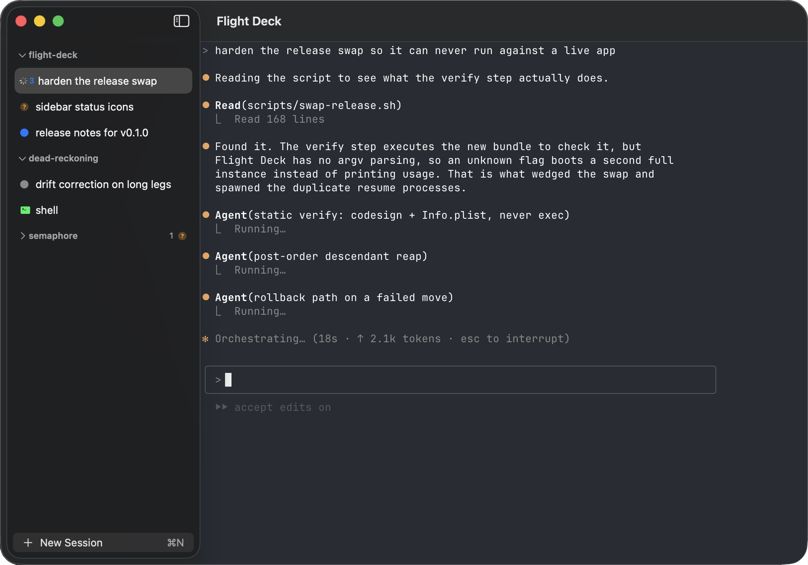

# Flight Deck

A macOS terminal for running a lot of coding agents at once.

One window holds every agent you have running, grouped by project. The sidebar reports
what each one is doing, so noticing that a session has stopped doesn't mean cycling
through a dozen terminal windows you can't tell apart.

## What it does

- Sessions sit under the project they belong to. Drop a folder on the sidebar to add
  one, drag sessions between projects, collapse what you're not watching.
- Each session is a real PTY rendered by Ghostty, not a log view. Escape sequences,
  scrollback and input all behave the way your agent expects.
- Every row says what its agent is doing — working, blocked on you, running a shell
  command, idle — by shape as well as colour. A session that fans out to subagents
  shows the count beside its spinner.
- Finish a run while you're in another tab and the row keeps an unread mark until you
  look at it. The mark survives a relaunch. A collapsed project reports the most
  demanding state underneath it, so nothing hides inside a group you closed.
- Quit and reopen and the deck comes back: every session reattached to its own
  conversation, in the order and grouping you left it, rather than starting fresh.
- Renames go both ways. Rename from the sidebar and the agent follows, or let the
  conversation name itself and the sidebar follows.
- ⌘N opens a session, ⌘⇧[ and ⌘⇧] walk the fleet across project boundaries, and ⌘W
  closes the session rather than the window. ⌘⇧T reopens what you just closed, the way a
  browser reopens a tab — back on its own conversation, in its old row. Keep pressing to
  walk further back; closing a whole project undoes in one press.
- Agent flags are set globally and overridden per project, from real controls instead
  of a half-remembered command line.
- Editors, terminals and git clients open on whatever the selected session is working on —
  ⌘O, ⌘T, or the buttons that fade in over the terminal when you move the mouse. Each is a
  shell command you can edit, so `$EDITOR` and your own tools work the way they do in a
  terminal.

## Status

Early. It runs, and it's what I use to build it, but it is nowhere near finished.

Apple Silicon only. The build is ad-hoc signed rather than notarised, so the first
launch needs a right-click → Open before macOS will let it start. Latest build is on
the [releases page](../../releases/latest).
